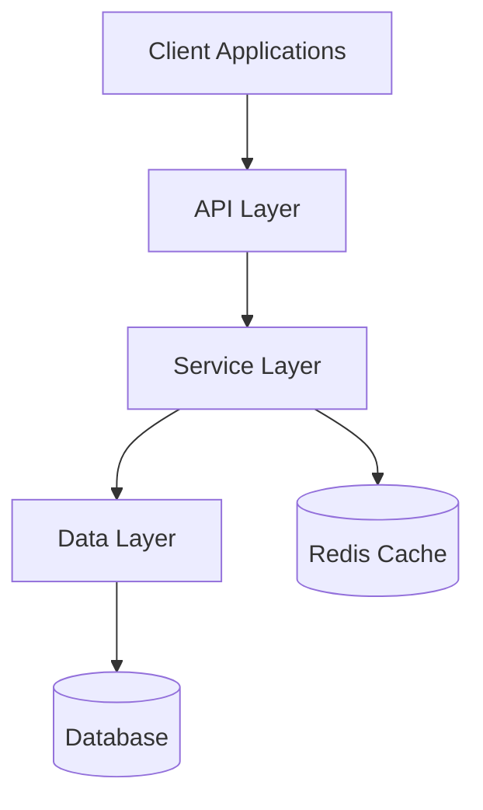
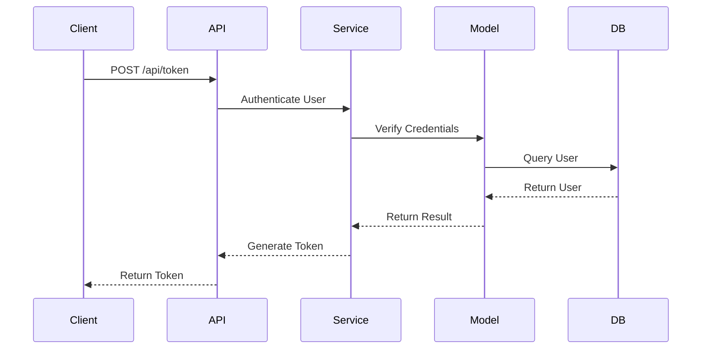
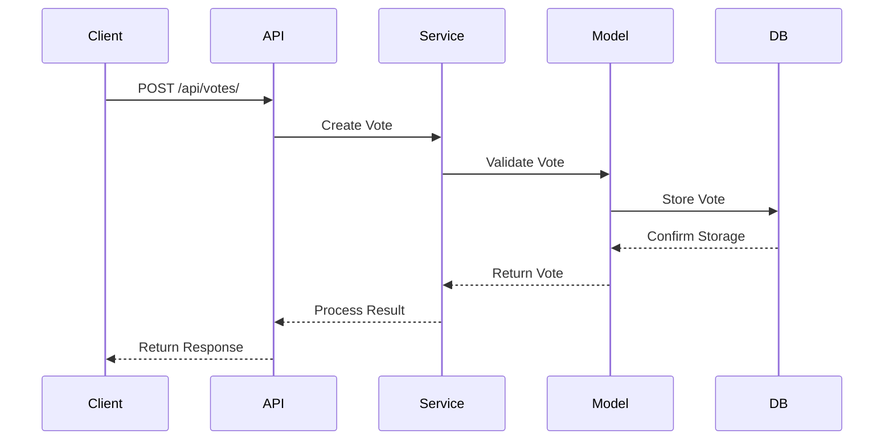
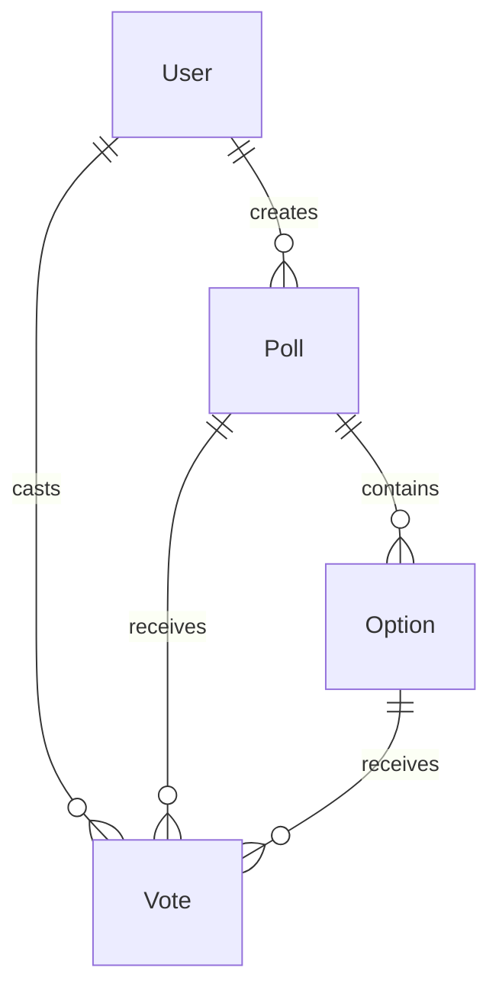
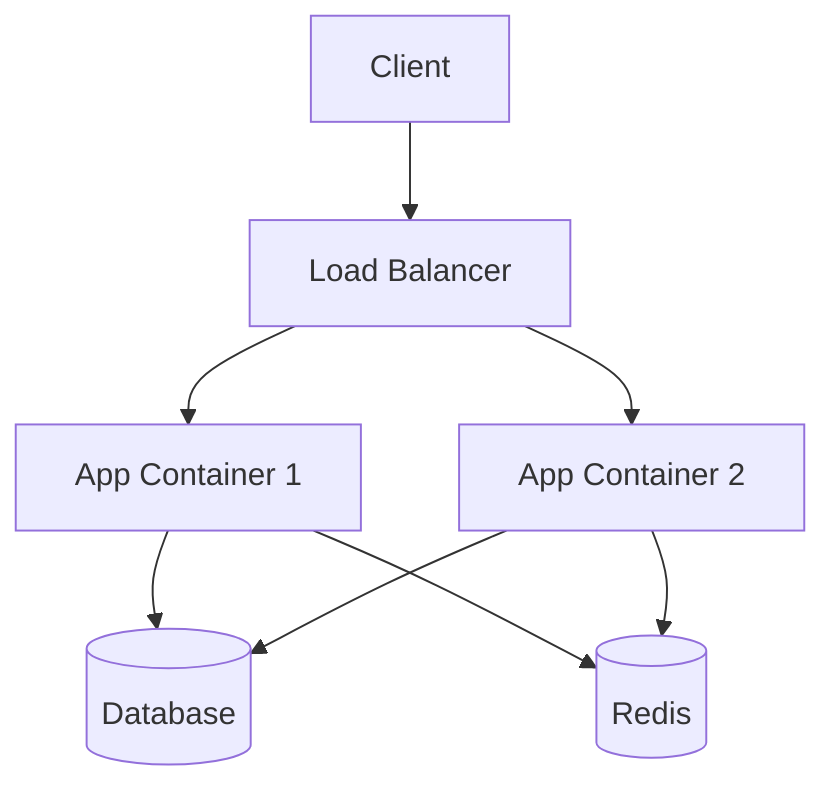

# The Commons Architecture

This document provides a detailed overview of The Commons architecture, including system design, components, and data flow.

## System Overview

The Commons is a modern, scalable voting system built with FastAPI and SQLAlchemy. It follows a layered architecture pattern with clear separation of concerns.



## Core Components

### 1. API Layer (`backend/api/`)

The API layer handles HTTP requests and responses, input validation, and authentication.

#### Key Components:
- **Routers**: Handle HTTP endpoints and request routing
- **Dependencies**: Manage authentication and database sessions
- **Schemas**: Define request/response models using Pydantic

```python
# Example Router Structure
router = APIRouter()
@router.post("/polls/", response_model=PollSchema)
async def create_poll(
    poll_data: PollCreate,
    current_user: User = Depends(get_current_active_user)
) -> Poll:
    """Create a new poll."""
```

### 2. Service Layer (`backend/services/`)

The service layer implements business logic and orchestrates data operations.

#### Key Components:
- **Business Logic**: Implements core functionality
- **Data Validation**: Ensures data integrity
- **Transaction Management**: Handles database transactions

```python
# Example Service Structure
class PollService:
    async def create_poll(self, poll_data: dict, user: User) -> Poll:
        """Create a new poll with validation."""
        # Business logic implementation
```

### 3. Data Layer (`backend/models/`)

The data layer manages database models and relationships.

#### Key Components:
- **SQLAlchemy Models**: Define database schema
- **Relationships**: Define model relationships
- **Migrations**: Handle schema changes

```python
# Example Model Structure
class Poll(Base):
    __tablename__ = "polls"

    id = Column(Integer, primary_key=True)
    title = Column(String, nullable=False)
    description = Column(Text)
    created_by = Column(Integer, ForeignKey("users.id"))
```

## Data Flow

### 1. Authentication Flow



### 2. Voting Flow



## Database Design

### Schema Overview



### Key Tables:
1. **users**
   - Primary user information
   - Authentication details
   - Role and permissions

2. **polls**
   - Poll metadata
   - Creation and update timestamps
   - Creator reference

3. **options**
   - Poll options
   - Option metadata
   - Poll reference

4. **votes**
   - Vote records
   - User and option references
   - Vote weight and timestamp

## Security Architecture

### 1. Authentication
- JWT-based authentication
- Token refresh mechanism
- Session management

### 2. Authorization
- Role-based access control
- Resource ownership validation
- Permission checks

### 3. Data Protection
- Input validation
- SQL injection prevention
- XSS protection
- CSRF protection

## Caching Strategy

### 1. Redis Cache
- Session storage
- Rate limiting
- Temporary data caching

### 2. Cache Invalidation
- Time-based expiration
- Event-based invalidation
- Manual cache clearing

## Performance Considerations

### 1. Database Optimization
- Connection pooling
- Query optimization
- Index management

### 2. API Performance
- Response compression
- Pagination
- Caching headers

### 3. Load Handling
- Rate limiting
- Request queuing
- Resource throttling

## Deployment Architecture

### 1. Containerization


### 2. Scaling Strategy
- Horizontal scaling
- Database replication
- Load balancing

## Monitoring and Logging

### 1. Application Logging
- Request logging
- Error tracking
- Performance metrics

### 2. System Monitoring
- Health checks
- Resource usage
- Alert system

## Development Workflow

### 1. Local Development
- Docker Compose setup
- Hot reloading
- Debug configuration

### 2. Testing Strategy
- Unit tests
- Integration tests
- Load tests
- Security tests

## Future Considerations

### 1. Planned Improvements
- Real-time updates
- Advanced analytics
- Mobile optimization

### 2. Scalability Plans
- Microservices architecture
- Message queue integration
- CDN integration