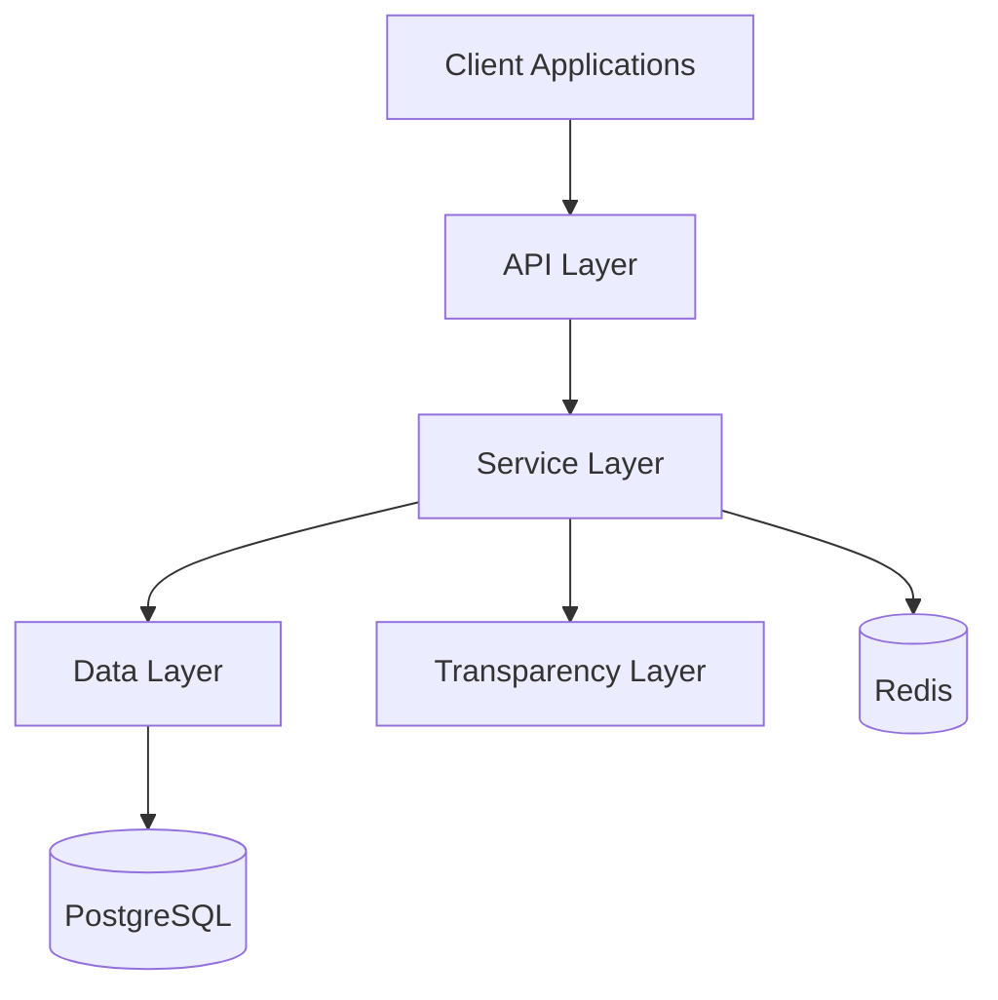

# The Commons – Architecture Overview

The Commons is an open platform for participatory decision-making. It enables dynamic delegation, real-time voting, and transparent activity tracking—designed for flexibility, trust, and long-term community engagement.

This document outlines the system architecture, core components, and data flow.

---

## System Overview

The Commons is built with:
- FastAPI (backend framework)
- SQLAlchemy (async ORM)
- PostgreSQL (database)
- Redis (caching/session management)

It follows a layered architecture for clarity and scalability:

Core Components

API Layer (backend/api/)

Handles HTTP requests, input validation, authentication, and routing.

Service Layer (backend/services/)

Implements business logic: delegation, voting, authentication, and activity logging.

Data Layer (backend/models/)

Defines SQLAlchemy models and database relationships.

Transparency Layer (backend/services/activity_log.py)

Logs all user actions (votes, delegations, poll creations) into a public activity feed for transparency and accountability.

---

Data Flow Examples

Authentication Flow

sequenceDiagram
    Client->>API: POST /api/token
    API->>Service: Authenticate User
    Service->>Model: Verify Credentials
    Model->>DB: Query User
    DB-->>Model: Return User
    Service-->>API: Generate Token
    API-->>Client: Return Token

Voting Flow

sequenceDiagram
    Client->>API: POST /api/votes/
    API->>Service: Create Vote
    Service->>Model: Validate Vote
    Model->>DB: Store Vote
    DB-->>Model: Confirm Storage
    Service-->>API: Process Result
    API-->>Client: Return Response

---

Database Design

Key Tables
	•	users – User profiles and credentials
	•	polls – Poll metadata and creator references
	•	options – Poll options
	•	votes – Individual votes linked to users and options
	•	delegations – Delegation records (dynamic, revocable)
	•	activity_log – Public log of system actions (transparency layer)

---

Security Overview
	•	JWT authentication + token refresh
	•	Role-based access control
	•	Input validation + SQL injection protection
	•	CSRF/XSS prevention
	•	Rate limiting via Redis

---

Performance Considerations
	•	Connection pooling and query optimization
	•	Caching with Redis
	•	Async request handling
	•	Pagination for large data sets

---

Future Considerations
	•	Trust metrics and reputation systems
	•	Frontend client for visualizing data
	•	Real-time updates (WebSockets)
	•	Microservices architecture (scalability)
	•	Advanced analytics and reporting

---

This architecture will evolve as the project grows—see docs/features.md for detailed features.